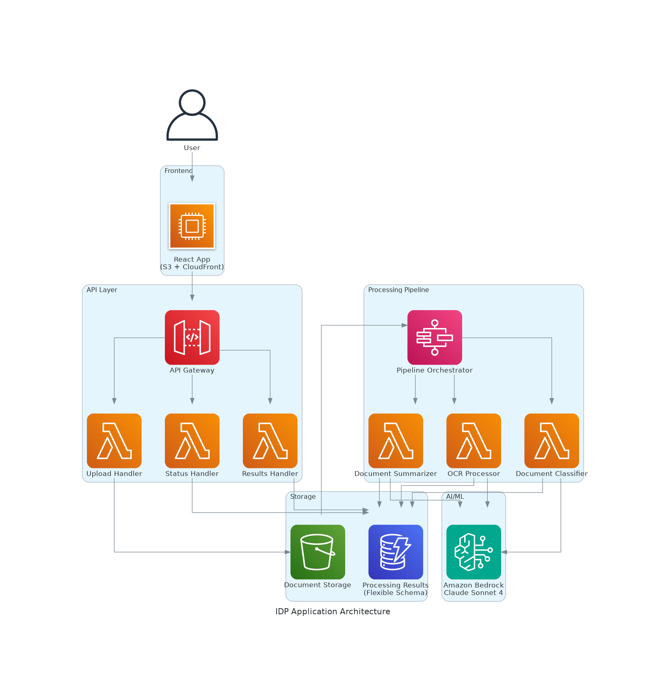

# Intelligent Document Processing (IDP) Application

A comprehensive document processing solution that extracts text, classifies documents, and generates summaries using AWS services and a React frontend.

## 🏗️ Architecture



The application follows a serverless architecture with the following components:

- **Frontend**: React application hosted on S3 with CloudFront
- **API Layer**: API Gateway with Lambda handlers
- **Processing Pipeline**: Step Functions orchestrating OCR, classification, and summarization
- **Storage**: S3 for documents, DynamoDB for results
- **AI/ML**: Amazon Bedrock Claude Sonnet 4 for all processing tasks

## 🚀 Live Demo

- **Frontend**: https://d1v7nlwylxwnpy.cloudfront.net
- **API**: https://bi23gaqewi.execute-api.us-east-1.amazonaws.com/prod/

## 📋 Features

### Document Processing Pipeline
1. **OCR (Optical Character Recognition)**: Extracts text content as key-value pairs in JSON format
2. **Document Classification**: Categorizes documents into predefined categories:
   - Dietary Supplement
   - Stationery  
   - Kitchen Supplies
   - Medicine
   - Other
3. **Document Summarization**: Generates concise summaries of document content

### User Interface
- Simple, professional upload interface
- Drag-and-drop file upload
- Real-time processing status updates
- Clean results display with OCR output, classification, and summary

## 🛠️ Technology Stack

### Backend
- **Infrastructure**: AWS CDK (TypeScript)
- **Compute**: AWS Lambda (Node.js 18.x)
- **Orchestration**: AWS Step Functions
- **API**: Amazon API Gateway
- **Storage**: Amazon S3, Amazon DynamoDB (Provisioned billing)
- **AI/ML**: Amazon Bedrock Claude Sonnet 4

### Frontend
- **Framework**: React 18
- **Hosting**: Amazon S3 + CloudFront
- **Styling**: Pure CSS (no external frameworks)

## 📁 Project Structure

```
idp-app-1759451803603/
├── specs/                          # Specification documents
│   ├── requirements.md             # User stories and acceptance criteria
│   ├── design.md                   # Technical architecture and design
│   └── tasks.md                    # Implementation plan and tasks
├── generated-diagrams/             # Architecture diagrams
│   └── idp-architecture.png        # System architecture diagram
├── cdk/                            # AWS CDK infrastructure code
│   ├── lib/idp-stack.ts           # Main CDK stack definition
│   ├── bin/cdk.ts                 # CDK app entry point
│   └── package.json               # CDK dependencies
├── frontend/                       # React frontend application
│   ├── src/                       # Source code
│   │   ├── App.js                 # Main application component
│   │   ├── index.js               # React entry point
│   │   └── index.css              # Application styles
│   ├── public/                    # Public assets
│   │   └── index.html             # HTML template
│   ├── build/                     # Production build
│   └── package.json               # Frontend dependencies
├── test-idp.js                    # API testing script
├── validate-artifacts.js          # Artifact validation script
└── README.md                      # This file
```

## 🔧 Development Setup

### Prerequisites
- Node.js 18+
- AWS CLI configured
- AWS CDK CLI installed

### Local Development

1. **Clone the repository**
   ```bash
   git clone https://github.com/pandson7/idp-app-1759451803603.git
   cd idp-app-1759451803603
   ```

2. **Install CDK dependencies**
   ```bash
   cd cdk
   npm install
   ```

3. **Install frontend dependencies**
   ```bash
   cd ../frontend
   npm install
   ```

4. **Start development server**
   ```bash
   npm start
   ```

### Deployment

1. **Deploy infrastructure**
   ```bash
   cd cdk
   npm run build
   npx cdk deploy
   ```

2. **Build and deploy frontend**
   ```bash
   cd ../frontend
   npm run build
   aws s3 sync build/ s3://your-frontend-bucket/
   ```

## 🧪 Testing

### Manual Testing
1. Open the frontend URL: https://d1v7nlwylxwnpy.cloudfront.net
2. Upload a document (images or PDFs supported)
3. Wait for processing to complete (typically 1-3 minutes)
4. Review the results:
   - OCR extracted key-value pairs
   - Document classification
   - Generated summary

### API Testing
Run the included test script:
```bash
node test-idp.js
```

### Artifact Validation
Validate all project artifacts:
```bash
node validate-artifacts.js
```

## 📊 AWS Resources

### Deployed Resources
- **S3 Buckets**: 
  - Documents: `idp-documents-1759446141824`
  - Frontend: `idp-frontend-1759446141824`
- **DynamoDB Table**: `idp-results-1759446141824`
- **Lambda Functions**: 5 functions for upload, OCR, classification, summarization, and results
- **Step Functions**: Processing pipeline orchestrator
- **API Gateway**: REST API with CORS enabled
- **CloudFront**: CDN for frontend distribution

### IAM Permissions
- Lambda execution role with Bedrock access
- S3 read/write permissions
- DynamoDB read/write permissions
- Step Functions execution permissions

## 🔒 Security Features

- IAM roles with least privilege access
- S3 bucket policies for secure document storage
- API Gateway with CORS configuration
- Bedrock model access through inference profiles
- No hardcoded credentials or sensitive data

## 📈 Performance Considerations

- **Provisioned DynamoDB**: Consistent performance for database operations
- **CloudFront CDN**: Global content delivery for frontend
- **Lambda concurrency**: Automatic scaling for processing workloads
- **Step Functions**: Reliable orchestration with error handling and retries

## 🔄 Processing Flow

1. User uploads document via React frontend
2. Upload handler generates presigned S3 URL and starts Step Functions execution
3. Document is stored in S3 bucket
4. Step Functions orchestrates sequential processing:
   - OCR extraction using Bedrock Claude Sonnet
   - Document classification using predefined categories
   - Summary generation using Bedrock Claude Sonnet
5. Results are stored in DynamoDB with flexible schema
6. Frontend polls for results and displays them when complete

## 📝 Specifications

This project follows a specification-driven development approach:

- **Requirements**: Detailed user stories with EARS notation acceptance criteria
- **Design**: Technical architecture with sequence diagrams and implementation considerations
- **Tasks**: Discrete, trackable implementation tasks with clear outcomes

See the `specs/` directory for complete documentation.

## 🤝 Contributing

1. Fork the repository
2. Create a feature branch
3. Follow the specification-driven development approach
4. Update documentation as needed
5. Submit a pull request

## 📄 License

This project is licensed under the MIT License - see the LICENSE file for details.

## 🆘 Support

For issues and questions:
1. Check the validation script output: `node validate-artifacts.js`
2. Review CloudWatch logs for Lambda functions
3. Test API endpoints using the test script: `node test-idp.js`
4. Open an issue in the GitHub repository

## 🎯 Future Enhancements

- Support for additional document formats
- Batch processing capabilities
- Advanced classification categories
- Multi-language support
- Document comparison features
- Integration with external systems
